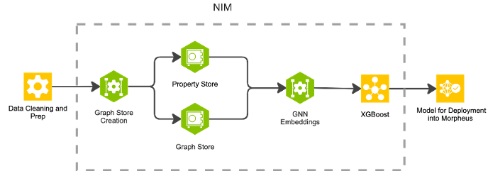

Copyright (c) 2025, NVIDIA CORPORATION. All rights reserved.

This source code and/or documentation ("Licensed Deliverables") are
subject to NVIDIA intellectual property rights under U.S. and
international Copyright laws.


# Model Training NIM

This repository contains the source code and documentation for the graph-based microservice, Model Training NIM, that focuses on training Graph Neural Network (GNN) and XGBoost models to predict fraud scores of credit card transactions.


Based on user provided training configuration, the NIM first builds a GNN model that produces embeddings for credit card transactions, and then the NIM uses the transaction embeddings to train an XGBoost model to predict fraud scores of the transactions. The NIM encapsulate the complexity of creating the graph in cuGraph and building key-value attribute store in WholeGraph. Once the graph is created, the GNN model is trained and used to produce the embeddings that are then feed to XGBoost.


<div style="display: flex; flex-direction: row; gap: 10px;">
  <figure style="text-align: center;">
    
    <figcaption>High-level overview of NIM architecture</figcaption>
  </figure>
  <figure style="text-align: center;">
    
    <figcaption>Model Training NIM</figcaption>
  </figure>
</div>


# How to build and use the NIM

## 1. Build the docker image
Clone the repository and build the Docker image by running the following commands:
```sh
 git clone https://gitlab-master.nvidia.com/RAPIDS/financial-fraud-training.git
 cd graph-nims
 docker build --no-cache -t model_training_nim .
 ```


## 2. Make sure that data is organized correctly
To train a GNN model, the dataset needs to be organized in the following structure:

```sh
  ├── gnn
  │   ├── edges.csv
  │   ├── features.csv
  │   ├── info.json
  │   └── labels.csv
```
`edges.csv` must contain the graph topology in COO format. Each line contains source and destination vertex id, and an optional edge attribute NOTE that the vertex IDs must be zero-based.

`src, dst, optional-attribute-value`

`info.json`, a json file, containing the number of transaction nodes, with key `NUM_TRANSACTION_NODES`.

```sh
  {
      "NUM_TRANSACTION_NODES": 1024
  }
```

`features.csv` must contain the features for each of the graph nodes, indexed by the vertex id. !Important: The first row of `features.csv` must contain name of the features, separated by commas.

`labels.csv` must contain 0 (non-fraud) or 1 (fraud) on each line, corresponding to each graph node, indicating if a transaction is fraud or not.


## 3. Write your training configuration

A training configuration file must be a JSON file with the following schema:

```bash
{
  "paths": {
    "data_dir":   // Directory path within the container where training data is mounted.
    "output_dir": // Directory path within the container where trained models will be saved.
  },

  "models": [
    //Provide your model configuration schema here (described below).
  ]
}
```
__Field Description__

`data_dir`: It must a path withing the container where the training data is mounted.

`output_dir`: It must a path withing the container where the models will be saved after the training.


As of now, the Training NIM supports two kinds of model trainings:
  - Train XGBoost on the embeddings produced by GNN (GraphSAGE) model
  - Train XGBoost directly on input features

The following two subsections describe the `Model Configuration Schema` for two types of trainings, and provide examples of full training configuration files.

### 3.1 Train an XGBoost on the embeddings produced by a GNN model


To train an XGBoost model on the embeddings produced by a GNN model, the model configuration should have the following schema.

Note that the `kind` field must be set to `GraphSAGE_XGBoost`, and it needs `hyperparameters` for a GNN (GraphSAGE) model and an XGBoost model. The values passed to the different fields are for example purposes only. The description next to the fields are to describe the fields.

```sh
    {
      "kind": "GraphSAGE_XGBoost", //Train an XGBoost on embeddings produces by a GraphSAGE model
      "gpu": "single",             // Indicates whether to use single-gpu or multi-gpu
      "hyperparameters": {
        "gnn": {                   // Hyper-parameters for a GraphSAGE that will produce embeddings
          "hidden_channels": 16,   // Number of hidden channels in the GraphSAGE model
          "n_hops": 1,             // Number of hops/layers
          "dropout_prob": 0.1,     // Dropout probability for regularization
          "batch_size": 1024,      // Batch size for training the model
          "fan_out": 16,           // Number of neighbors to sample per node
          "num_epochs": 16         // Number of training epochs
        },
        "xgb": {  // Hyper-parameters of an XGBoost model that will predict fraud score using embeddings as input
          "max_depth": 6,          // Maximum depth of the tree
          "learning_rate": 0.2,    // Learning rate for boosting
          "num_parallel_tree": 3,  // Number of trees built in parallel
          "num_boost_round": 512,  // Number of boosting rounds
          "gamma": 0.0             // Minimum loss reduction required to make a further partition on a leaf node
        }
      }
```

The `gamma`, `dropout_prob` and `learning_rate` fields take floating point values and the rest of the fields take integer values.


Here is example of a full training configuration file for training an XGBoost model on the embeddings produced by a GNN model.


```sh
{
  "paths": {
    "data_dir": "/data",                   // Directory path within the container where training data is mounted.
    "output_dir": "/trained_models"   // Directory path within the container where trained models will be saved.
  },

  "models": [
    {
      "kind": "GraphSAGE_XGBoost", //Train an XGBoost on embeddings produces by a GraphSAGE model
      "gpu": "single",             // Indicates whether to use single-gpu or multi-gpu
      "hyperparameters": {
        "gnn": {                   // Hyper-parameters for a GraphSAGE that will produce embeddings
          "hidden_channels": 16,   // Number of hidden channels in the GraphSAGE model
          "n_hops": 1,             // Number of hops/layers
          "dropout_prob": 0.1,     // Dropout probability for regularization
          "batch_size": 1024,      // Batch size for training the model
          "fan_out": 16,           // Number of neighbors to sample per node
          "num_epochs": 16         // Number of training epochs
        },
        "xgb": {  // Hyper-parameters of an XGBoost model that will predict fraud score using embeddings as input
          "max_depth": 6,          // Maximum depth of the tree
          "learning_rate": 0.2,    // Learning rate for boosting
          "num_parallel_tree": 3,  // Number of trees built in parallel
          "num_boost_round": 512,  // Number of boosting rounds
          "gamma": 0.0             // Minimum loss reduction required to make a further partition on a leaf node
        }
      }
    }
  ]
}
```

### 3.2 Train an XGBoost directly on input features

To train an XGBoost model directly on input features, the model configuration should have the following schema, and the `kind` field must be set to `XGBoost`.


```sh
    {
      "kind": "XGBoost",          // Train XGBoost directly on input features
      "gpu": "single",            // Indicates whether to use single-gpu or multi-gpu
      "hyperparameters": {
        "max_depth": 6,           // Maximum tree depth
        "learning_rate": 0.2,     // Learning rate for the boosting process
        "num_parallel_tree": 3,   // Number of trees built in parallel
        "num_boost_round": 512,   // Total number of boosting rounds
        "gamma": 0.0              // Minimum loss reduction required to make a further partition on a leaf node
      }
    }
```

The `learning_rate` and `gamma`  fields take floating point values and the rest of the fields take integer values.


Here is example of a full training configuration file for training an XGBoost model on directly on input features.

```sh
{
  "paths": {
    "data_dir": "/data",                   // Directory path within the container where input data is stored.
    "output_dir": "/trained_models"   // Directory path within the container where trained models will be saved.
  },

  "models": [
    {
      "kind": "XGBoost",          // Train XGBoost directly on input features
      "gpu": "single",            // Indicates whether to use single-gpu or multi-gpu
      "hyperparameters": {
        "max_depth": 6,           // Maximum tree depth
        "learning_rate": 0.2,     // Learning rate for the boosting process
        "num_parallel_tree": 3,   // Number of trees built in parallel
        "num_boost_round": 512,   // Total number of boosting rounds
        "gamma": 0.0              // Minimum loss reduction required to make a further partition on a leaf node
      }
    }
  ]
}
```


NOTE: As of now, the NIM only supports single-gpu training and hence the `gpu` field must be to `single` for both kinds of models.

### 3. Finally run the training

Execute the following command to run the training inside the Docker container. Make sure to replace `<path_to_data_dir_on_host>`, `<path_to_model_output_dir_on_host>`, and `<path_to_training_config_json_file>` with the actual paths to your input data directory, the output directory where the data should be saved, and the configuration file, respectively.

 ```sh
 docker run --cap-add SYS_NICE -it --rm --gpus "device=0" -v <path_to_data_dir_on_host>:/data -v <path_to_model_output_dir_on_host>:/trained_models -v <path_to_training_config_json_file>:/app/config.json training_nim --config /app/config.json
```

#### Command Explanation

    --cap-add SYS_NICE: Grants the container the capability to adjust process scheduling priorities.
    --it: Runs the container in interactive mode with a TTY.
    --rm: Automatically removes the container after it exits.
    --gpus "device=0": Limits the container's GPU access to GPU 0 only.
    -v <path_to_data_dir_on_host>:/data: Mounts your local data directory into the container at /data.
    -v <path_to_model_output_dir_on_host>:/trained_models: Mounts your output directory the models will be saved into the container at path /trained_models.
    -v <path_to_training_config_json_file>:/app/config.json: Mounts your local training configuration JSON file into the container at /app/config.json
    training_nim: Name of NIM container.
    --config /app/config.json: Passes the configuration file path to the training code inside the container.

According the example training configurations show above, training data must be mounted under `/data` within the container.


For example, for the following concrete docker run command,

```sh
docker run --cap-add SYS_NICE -it --rm --gpus "device=0" -v /home/user/data/TabFormer:/data -v /home/user/deploy/models:/trained_models -v ./training_configuration.json:/app/config.json training_nim --config /app/config.json
```

 `-v /home/user/data/TabFormer:/data` will mount your host directory `/home/user/data/TabFormer` under `/data` inside the container, and `-v ./training_configuration.json:/app/config.json` will mount `training_configuration.json`, from the current directory of your host machine, to `/app/config.json` within the container.

Similary, `-v /home/user/deploy/models:/trained_models` will mount your host directory `/home/user/deploy/models` under `/trained_models` inside the container.
